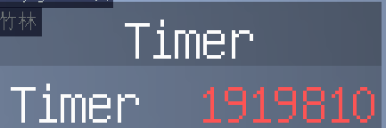
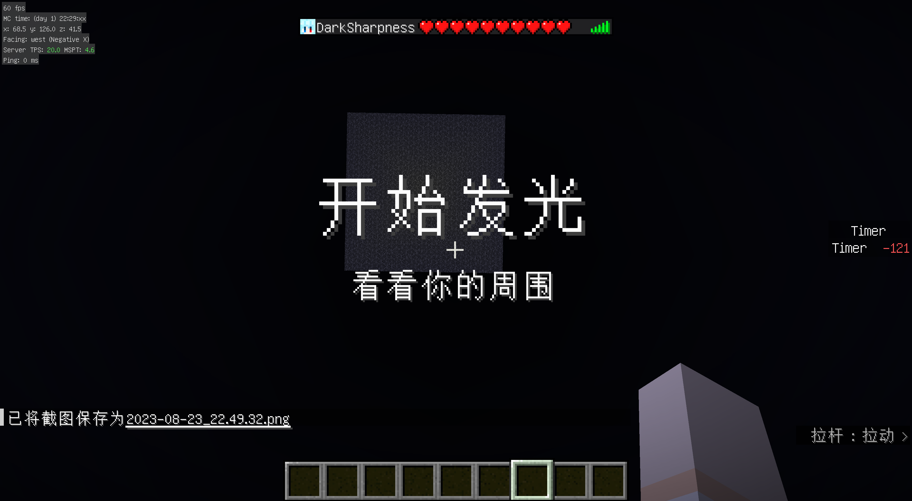

# Minecraft Impart 服务器 EHC 规则与说明:

目前 mc 版本 : 1.20.4

**游戏难度为   : Normal**

目前已经有 2 个常见拓展 DLC 玩法。

- [EHC-Full](docs/full.md)
- [EHC-30min](docs/30.md)

## 1.基本规则

注意: 文章中可能会出现某些大写字母，作为游戏参数。

EHC (Easy HardCore)，类似原版 UHC，属于原版生存类 pvp ，但是难度有显著下调。玩家一开始被限制边长为 $R_0$ 的正方形区域内 (包括主世界和下界) ，不同队伍初始被分配到不同的角落。所有玩家初始一无所有，从 0 开始生存，玩家需要在存活下来的同时发育，并且消灭敌队，死亡后将不可复活! 当场上只有一只队伍的时候，该队伍获胜。

## 赛前准备

在比赛开始前，有 $60\text{s}$ 观察阶段 和 $30\text{s}$ 预备阶段。

在观察阶段，玩家作为观察者模式，在固定高度飞行，可以提前观察全部地形。

在预备阶段，玩家按照队伍被随机传送，分配到不同角落，该阶段玩家可以自由移动。

## 正式比赛

在比赛开始后，玩家将会获得永久夜视、速度、速度挖掘，以及 $600\text{s}$ (相当于第一个白天的长度) 隐身。

在 $T_0$ 之后 ，边界将会 在 $T_1$ 的时间内均匀收缩到边长 $R_1$ 左右 (取决于具体情况) 。

特别地，当一个玩家周围半径 $32$ 的区域内出现其他玩家时候，两位玩家会发光 $1\text{s}$ 。

## 最终阶段

在收缩完成后，会保持状态 $T_2$ ，同时全体玩家发光。

随后玩家，将会被强制 tp 到基岩平台上进行决斗。基岩平台为中空的封闭结构，高度为 $8$，直径为 $32$ 左右。

玩家 tp 到基岩平台后，不同队伍会分配到不同的角落。随后 $T_3$ 时间内玩家自由建筑，禁止 pvp。

在这之后，开始决斗 pvp ，且所有队伍发光。

## 2.其他规则以及要求

以下是一些 **能** 做的事情:

* [X] 使用光影或一般材质包
* [X] 使用矿物高光材质包
* [X] 利用原版信息/bug (例如 F3/卡透视)
* [X] 在沟通后，补偿由于服务器卡顿带来的损失
* [X] 使用 /kill 指令自杀

以下是一些 **不能** 做的事情:

* [ ] ~~村民交易~~(现在不管了)
* [ ] ~~观察者汇报队友视野外信息(报点)~~(现在允许了)
* [ ] 卡服/崩服
* [ ] 使用超过原版信息的 mod (如小地图,xray)
* [ ] 未经允许使用违规指令
* [ ] 赛前研究比赛场地
* [ ] 赛前在比赛场地进行交互

## 3.一些细节

计时器目前使用数据包来实现。你可以在侧边栏看到，如图所示:

同时，在游戏的关键时间点，会有字幕提示。在按下 TAB 的时候，你也能看到所有玩家的血量，大致如下图所示:

如果你有更好的方案，欢迎提出! 目前可调参数如下:

- $R_0$ : 地图半径
- $R_1$ : 缩圈结束后半径
- $T_0$ : 缩圈的时刻
- $T_1$ : 缩圈总时长
- $T_2$ : 缩圈结束后停留时长
- $T_3$ : 基岩平台上自由建筑时长

## 4.一些重要的时间点

记游戏正式开始的相对时间为 0 :

| 相对时间(s)           | 大致事件                                                       |
| --------------------- | -------------------------------------------------------------- |
| $-90$               | 玩家以旁观者的形式自由观察世界                                 |
| $-30$               | 玩家变为冒险模式，直接从当前位置落地，允许自由移动             |
| $0$                 | 玩家变为生存模式，并且获得 $600\text{s}$ 隐身和一些永久增益 |
| $600$               | 夜幕降临，隐身结束                                             |
| $T_0$               | 开始缩圈                                                       |
| $T_0+T_1$           | 缩圈结束，全体玩家发光                                         |
| $T_0+T_1+T_2$       | 全体存活玩家传送到平台，玩家开始自由建筑                       |
| $T_0+T_1+T_2 + T_3$ | 开始最终 pvp                                                   |

## Q & A

本项目的 Question & Answer 专区请[点击跳转](issue.md)

如有更多问题或想要提供的 Features ，请在 Github Issue 或者 [网页评论区(推荐)](https://darksharpness.github.io/mcImpart) 提出。

> $\copyright$ 2023-2024 DarkSharpness - Impart 保留所有权利
